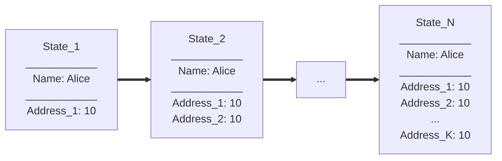
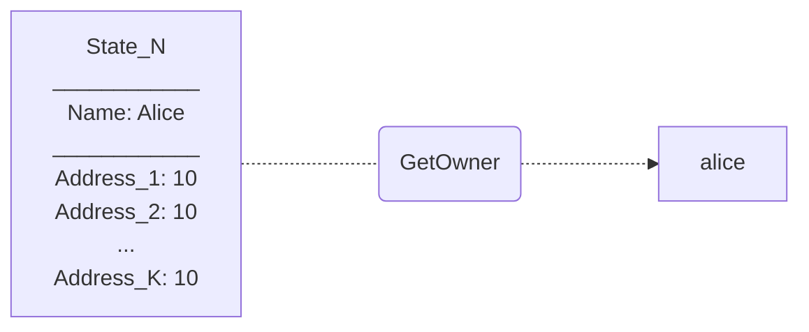
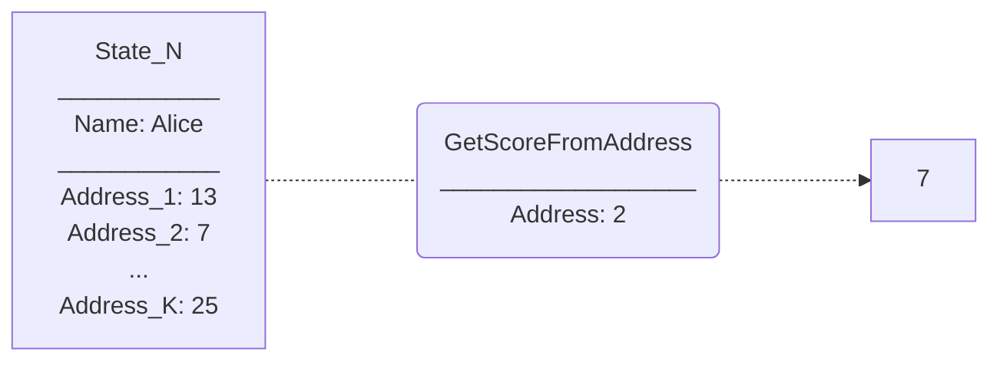
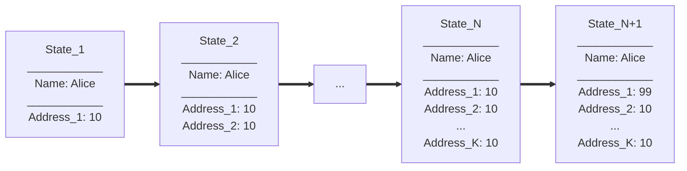
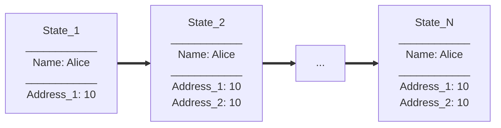
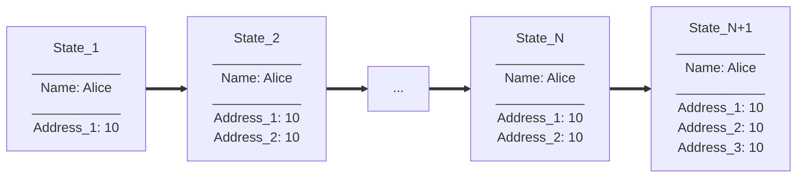

# Ethan Gnibus Smart Contract
## What is a Smart Contract?
To keep it simple, [Smart contracts](https://en.wikipedia.org/wiki/Smart_contract) control the logic of operations that happen on [blockchains](https://en.wikipedia.org/wiki/Blockchain). Smart contracts track their internal history through states that are saved when actions are preformed. A smart contract that tracks N states could be visualized below:
```Mermaid
flowchart  LR
A[State_1] ==> B[State_2] ==> C[...] ==> D[State_N]
```
## Why the Ethan Gnibus Smart Contract is special? 
The Ethan Gnibus Smart Contract is built on [Terra](https://docs.terra.money/), the leading decentralized and open-source public blockchain protocol for [algorithmic stablecoins](https://en.wikipedia.org/wiki/Stablecoin).
### Each state in this particular contract will contain addresses with corresponding scores.
We could represent this as the following, where 1 <= K <= N:
```Mermaid
flowchart  LR
A[State_1\n____________\nAddress_1: 10] ==> B[State_2\n____________\nAddress_1: 10\nAddress_2: 10] ==> C[...] ==> D[State_N\n____________\nAddress_1: 10\nAddress_2: 10\n...\nAddress_K: 10]
```

As we can see, the architecture of the state looks very similar to that of a Dictionary in Python.

### Each state will also store an identifier of the user who created the instance of the smart contract.
So if Alice created one instance of the smart contract we would have:
```Mermaid
flowchart  LR
A[State_1\n____________\nName: Alice\n____________\nAddress_1: 10] ==> B[State_2\n____________\nName: Alice\n____________\nAddress_1: 10\nAddress_2: 10] ==> C[...] ==> D[State_N\n____________\nName: Alice\n____________\nAddress_1: 10\nAddress_2: 10\n...\nAddress_K: 10]
```
And if Bob created another instance we would have:
```Mermaid
flowchart  LR
A[State_1\n____________\nName: Bob\n____________\nAddress_1: 10] ==> B[State_2\n____________\nName: Bob\n____________\nAddress_1: 10\nAddress_2: 10] ==> C[...] ==> D[State_N\n____________\nName: Bob\n____________\nAddress_1: 10\nAddress_2: 10\n...\nAddress_K: 10]
```
### Queries
Another feature of the Ethan Gnibus Smart Contract is that it implements queries that can extract information from its states without editing the state's contents.
#### Query 1: Getting the owner of an instance of a smart contract
If there exists a state history like the following, it is useful to find out who initialized the smart contract.

To do this, this contract implements a query that returns the "owner" field of the current state.

#### Query 2: Getting a score using a corresponding address
Over time the addresses in the state history will populate so extracting information from the corresponding scores could be useful. This contract uses the current state to extract corresponding scores.

### Executes
Another feature of the Ethan Gnibus Smart Contract is that it implements executable commands that can update it's internal state.
#### Execute 1: The owner of the contract can edit the score of an address
The owners of contract instances could edit the scores at corresponding addresses. For example, if the state history is:

The owner could update the score at Address_1 to be 99. After this the state history will become:

#### Execute 2: Anyone can update the state with a new address
Any user could add a score at a new address. For example, if the state history is:

Any user could make Address_3 and store 10 in it:

## Footer

This project is based on the [CosmWasm Starter Pack](https://github.com/InterWasm/cw-template).
